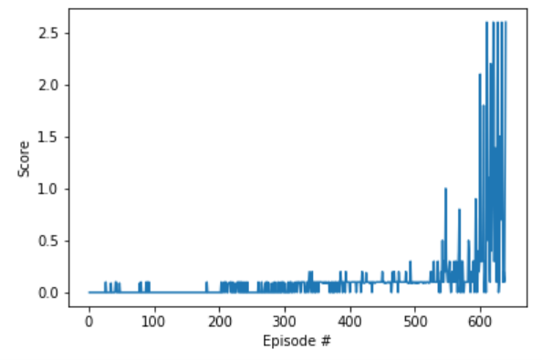

# Algorithm, HyperParameters and Neural Network Architecture

## Algorithm
The algorithm used for this project is MADDPG, Multi Agent Deep Deterministic Policy Gradients, which has been shown to be very effective at solving continuous action space environments, like the Tennis environment.

In this project, two agents with separate actor and critics interact with the environment while adding their experiences to a shared replay buffer. The replay buffer contains all the information from each turn of both agents including states, actions and rewards. From this buffer, each agent is able to sample in order to learn the best action for a particular state. Noise is also added in order to help each agent explore, but it is reduced over time with a decay factor that gradually reduces the effect of the noise on the agents' actions.

## Hyperparameters
The hyperparameters for the algorithm were set as follows:

* Buffer Size 1e5

* Batch Size 256

* Gamma 0.99

* Tau 1e-3

* Learning Rate for Actor 1e-4
	
* Learning Rate for Critic 3e-4
	
* Weight Decay 0

* Learning steps (sets how often the gradient is updated-expressed in times per timestep) 3

* Noise weight starts at 1.0, decays to a minimum of 0.1

* Noise decay .9999

## Neural Network Architecture
The neural network for this is smaller than that described in the [DDPG paper](https://arxiv.org/abs/1509.02971) with both the actor and the critic having 256 nodes in the first layer and 128 in the second layer. RELU activation is used between the layers and optimized using the Adam optimizer.

## Plot of Rewards
The graph below plots the average rewards over 100 consecutive episodes, showing that the environment trained to an average of .51 in just 539 episodes.

## Ideas for Future Work
It would be interesting to try this on a more complicated environment, like the Unity soccer environment. The soccer environment, since the agents have more actions available would probably take longer to train, and may require some different parameters to account for this more complex environment. 
